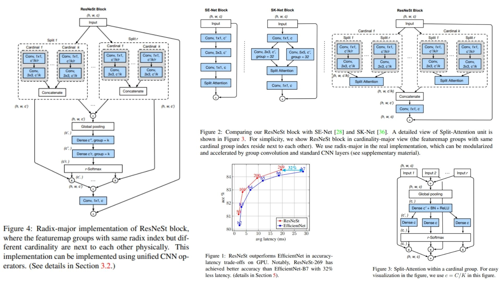

# 🌌 ResNeSt-Replication — Split-Attention ResNet

This repository provides a **faithful PyTorch replication** of the  
**ResNeSt architecture** for image recognition tasks.

The emphasis is on **reproducing the paper’s block design, split-attention mechanism, and cardinality/radix scheme**, rather than benchmarking speed or large-scale performance.  
The code is modular, interpretable, and ideal for research or educational purposes.

Highlights include:

* Residual bottleneck blocks with **split-attention** ✨  
* Radix-major feature aggregation 🔮  
* Modular implementation using standard CNN layers 🧩  

Paper reference: *[ResNeSt: Split-Attention Networks](https://arxiv.org/abs/2004.08955)*

---

## Overview — Split-Attention ResNet 🖼️



> Split-attention + radix-cardinality grouping enables adaptive channel-wise feature recalibration.

ResNeSt modifies standard ResNet by:

* Stacking $$L$$ residual bottleneck blocks with configurable **radix $$R$$** and **cardinality $$K$$**  
* Splitting feature maps across radix dimension and applying attention weighting  
* Summing weighted splits to aggregate features while preserving residual connections  

This yields **more expressive feature representations while maintaining efficient computation**.

---

## Feature Map Setup 📐

Input tensor:

$$
X \in \mathbb{R}^{B \times C \times H \times W}
$$

Radix-major splits:

$$
\text{splits} = \text{split}(X, \text{radix}=R)
$$

Weighted aggregation:

$$
\text{out} = \sum_{r=1}^{R} \text{att}_r \odot \text{split}_r
$$

where $$\text{att}_r$$ is computed using **rSoftMax** across radix dimension.

---

## Bottleneck & Split-Attention Block 🜏

The ResNeSt bottleneck updates features as:

$$
Y = X + \text{Conv1x1} \to \text{SplitAttention} \to \text{Conv1x1}(X)
$$

where:

* **SplitAttention** splits channels, applies global pooling, MLP, rSoftMax, and recombines weighted splits  
* Residual connections preserve feature identity across layers  
* Expansion factor $$e=4$$ ensures output channels are scaled properly

---

## Split-Attention Mechanism 🔗

1. Convolve input to produce $$C \times R$$ channels  
2. Split tensor into $$R$$ splits along channel dimension  
3. Compute **global average pooled** representation:

$$
\text{gap} = \text{GAP}\Big(\sum_{r=1}^{R} \text{split}_r\Big)
$$

4. Apply MLP:

$$
\text{att} = \text{rSoftMax}\Big(\text{MLP}(\text{gap})\Big)
$$

5. Weight splits and sum:

$$
\text{out} = \sum_{r=1}^{R} \text{att}_r \odot \text{split}_r
$$

This implements adaptive recalibration for each radix split.

---

## Why ResNeSt Matters 🌟

* Adaptive channel-wise attention improves representational power  
* Radix-cardinality grouping balances efficiency and expressiveness  
* Residual bottlenecks with split-attention improve learning stability  
* Modular and interpretable, suitable for research and experimentation  

---

## Repository Structure 🏗️

```bash
ResNeSt-Replication/
├── src/
│   │
│   ├── layers/
│   │   ├── splat_attention.py      # SplitAttention (Radix Softmax + Reweighting)
│   │   ├── rsoftmax.py             # Softmax over radix dimension
│   │   └── bottleneck_block.py     # Bottleneck block: Conv1x1 → SplitAttention → Conv1x1 + Residual
│   │
│   ├── backbone/
│   │   └── resnest_stage.py        # Stack of bottleneck blocks (like ResNet stage)
│   │
│   ├── model/
│   │   └── resnest_model.py        # Stem → Stages → Global Pool → FC (optional)
│   │
│   ├── pipeline/
│   │   └── inference_pipeline.py   # Apply network, visualize split-attention weighting
│   │
│   └── config.py                   # radix R, cardinality K, bottleneck_width, groups
│
├── images/
│   └── figmix.jpg
│
├── figures/
│   └── figmix.jpg                        
│
├── requirements.txt
└── README.md
```

---


## 🔗 Feedback

For questions or feedback, contact: [barkin.adiguzel@gmail.com](mailto:barkin.adiguzel@gmail.com)
